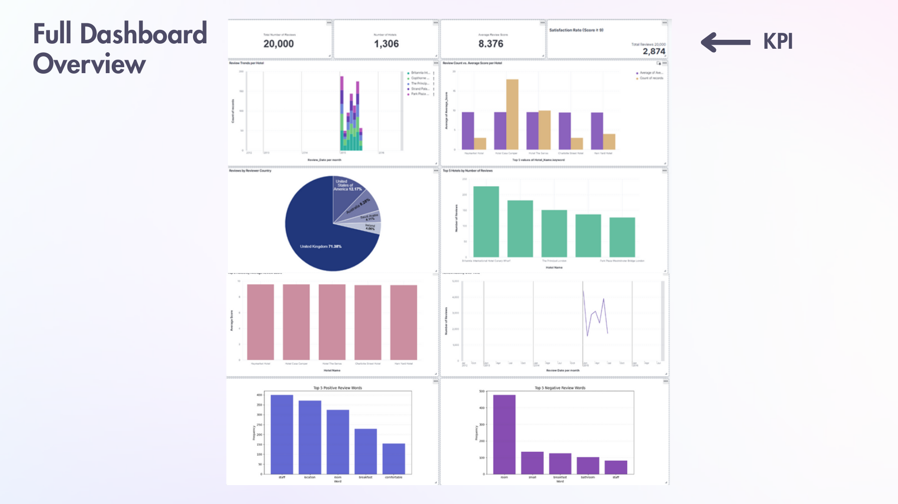
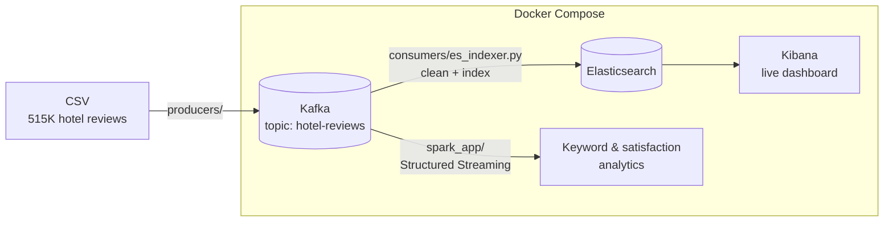
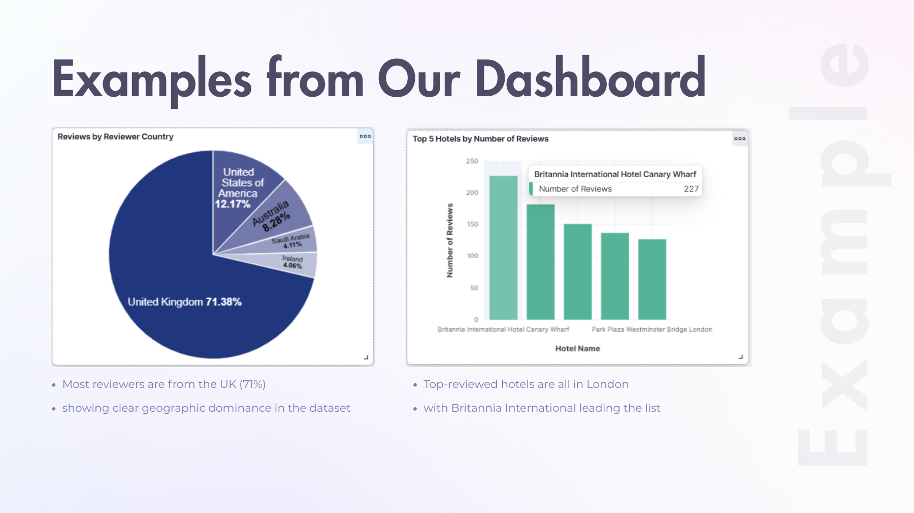
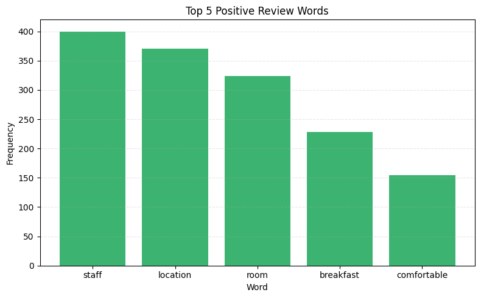
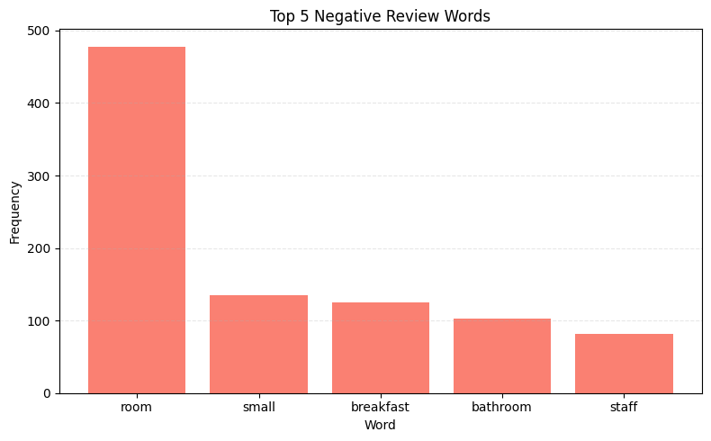

# Hotel Reviews Real-Time Streaming Pipeline

An end-to-end real-time pipeline that turns a continuous stream of hotel reviews into live business insight, built with **Docker**, **Kafka**, **Spark Structured Streaming**, **Elasticsearch** and **Kibana**.



---

## 🎯 Business Motivation

Hotels and travel companies receive **massive volumes of online reviews** every day. Those reviews show how satisfied customers are, how service quality is trending, and which complaints keep recurring. Without automation, most of that insight is missed or found too late.

This project turns raw reviews into **real-time, actionable insight**, enabling:

- Early detection of satisfaction drops
- Identification of operational issues at specific hotels
- Monitoring of reviewer geography and behavior
- Tracking of trending positive and negative keywords
- Analysis that takes seconds instead of hours of manual reading

---

## 🧱 System Architecture



| Component | Role |
|---|---|
| **Producer** (`producers/send_all_columns_to_kafka.py`) | Reads the reviews CSV with pandas and publishes each row as a JSON message to the `hotel-reviews` topic, simulating a live stream |
| **Kafka** (KRaft mode) | Buffers the stream and decouples ingestion from processing, so each consumer reads at its own pace |
| **Elasticsearch indexer** (`consumers/es_indexer.py`) | Cleans each review (missing values, types, dates) and bulk-indexes it with a deterministic `Review_ID`, so re-ingestion never creates duplicates |
| **Spark Structured Streaming** (`spark_app/`) | Parses the JSON stream against a schema and computes per-hotel positive and negative keyword counts, average scores and monthly satisfaction |
| **Elasticsearch + Kibana** | Full-text search, aggregations and the live dashboard |
| **Debug consumer** (`consumers/print_reviews_consumer.py`) | Prints raw messages from the topic, for verifying the stream |

---

## 📊 Dashboard & Insights

**KPIs on a 20,000-review sample:** 20,000 reviews · 1,306 hotels · average score 8.38 · 2,874 reviews scored 9 or higher.



- **Geographic concentration:** 71% of reviewers are from the UK, then the US (12%) and Australia (8%).
- **Volume leaders:** the most-reviewed hotels are all in London, led by Britannia International Hotel Canary Wharf.
- **What drives satisfaction:** *staff*, *location* and *room* lead positive reviews. *Room*, *small*, *breakfast* and *bathroom* lead negative ones. The room itself is the top driver of both praise and complaints.

| Top positive words | Top negative words |
|---|---|
|  |  |

---

## 🧩 Challenges & Solutions

| Challenge | Solution |
|---|---|
| Learning Kafka, Docker, Spark and Kibana from scratch | Built the multi-container environment with `docker-compose` and debugged listener, networking and configuration issues across services |
| Duplicate reviews on re-ingestion | Generated a unique `Review_ID` per review and used it as the Elasticsearch document ID, so ingestion is **idempotent** |
| Missing libraries inside containers | Centralized dependencies in `requirements.txt` |
| Kibana not showing live data | Converted `Review_Date` to ISO format and adjusted Kibana's time filters |
| Messy real-world text | Cleaning logic for missing values, placeholder text ("No Positive"/"No Negative") and inconsistent formatting |

---

## 📁 Repository Structure

```
hotel-reviews-streaming-pipeline/
├── producers/
│   └── send_all_columns_to_kafka.py   # CSV → Kafka
├── consumers/
│   ├── es_indexer.py                  # Kafka → clean → Elasticsearch
│   └── print_reviews_consumer.py      # Debug consumer
├── spark_app/
│   ├── spark_kafka_nlp.py             # Streaming keyword counts (console)
│   ├── spark_kafka_dashboard.py       # Streaming score/keyword/seasonal aggregates
│   └── hotel_reviews_batch_analysis.py# Same analyses in batch mode on the CSV
├── jars/                              # Spark–Kafka connector JARs
├── docs/
│   ├── Big_Data_Project.pdf           # Final project presentation
│   └── images/                        # Dashboard screenshots
├── docker-compose.yml                 # Kafka, Elasticsearch, Kibana, Spark
└── requirements.txt
```

---

## 🚀 How to Run

**Dataset:** [515K Hotel Reviews Data in Europe](https://www.kaggle.com/datasets/jiashenliu/515k-hotel-reviews-data-in-europe) (Kaggle). Save it as `data/Hotel_Reviews.csv`.

```bash
# 1. Start the infrastructure (Kafka, Elasticsearch, Kibana, Spark)
docker-compose up -d

# 2. Install Python dependencies
pip install -r requirements.txt

# 3. Start the Elasticsearch indexer (leave it running)
python consumers/es_indexer.py

# 4. In another terminal, stream reviews into Kafka
python producers/send_all_columns_to_kafka.py

# 5. (Optional) Run the Spark streaming analytics inside the Spark container
docker exec -it spark spark-submit --jars "/app/jars/*" /app/spark_app/spark_kafka_nlp.py
```

Then open Kibana at **http://localhost:5601**, create a data view for `hotel-reviews` with `Review_Date` as the time field, and build visualizations.

> Kafka advertises itself as `kafka:9092`. To connect from host-side Python scripts, add `127.0.0.1 kafka` to your hosts file.

---

## 🔮 Next Steps: Adding AI

- **LLM aspect-based sentiment:** replace keyword counts with structured `{aspect, sentiment, severity}` extraction per review.
- **Semantic search / RAG over reviews:** use Elasticsearch vector search so managers can ask *"What are guests saying about breakfast in our London hotels this month?"*
- **Anomaly alerts:** notify the hotel when negative sentiment for an aspect spikes.

---

## 👤 Author

Sharon Kamensky, B.Sc. in Mathematics (Statistics & Data Science)
GitHub: https://github.com/SharonKamensky
